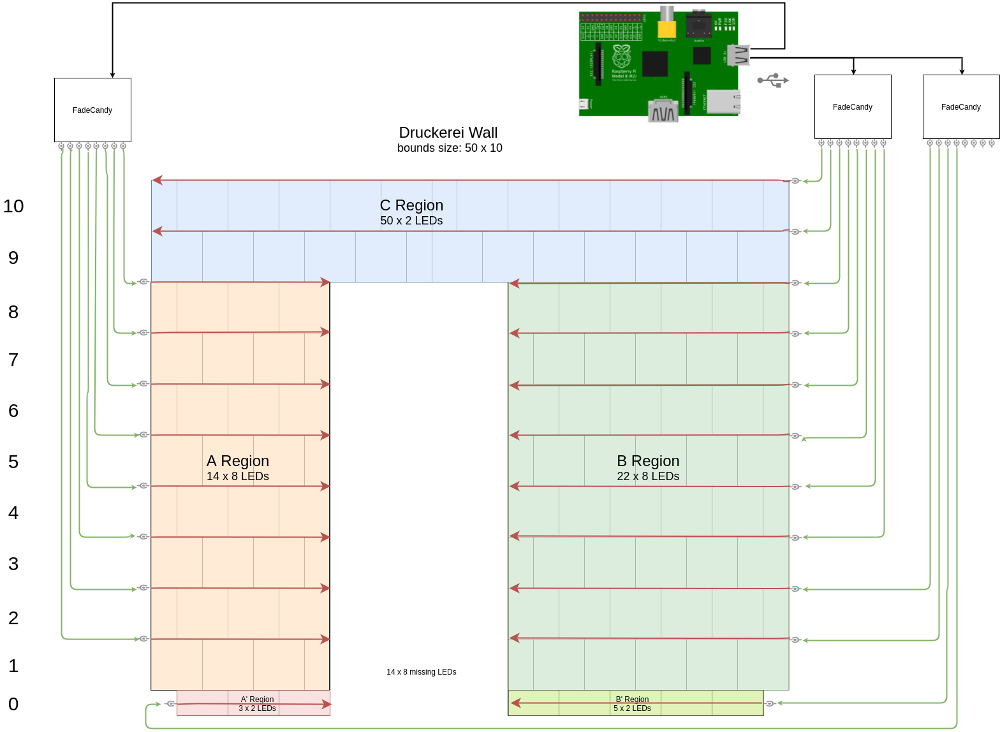
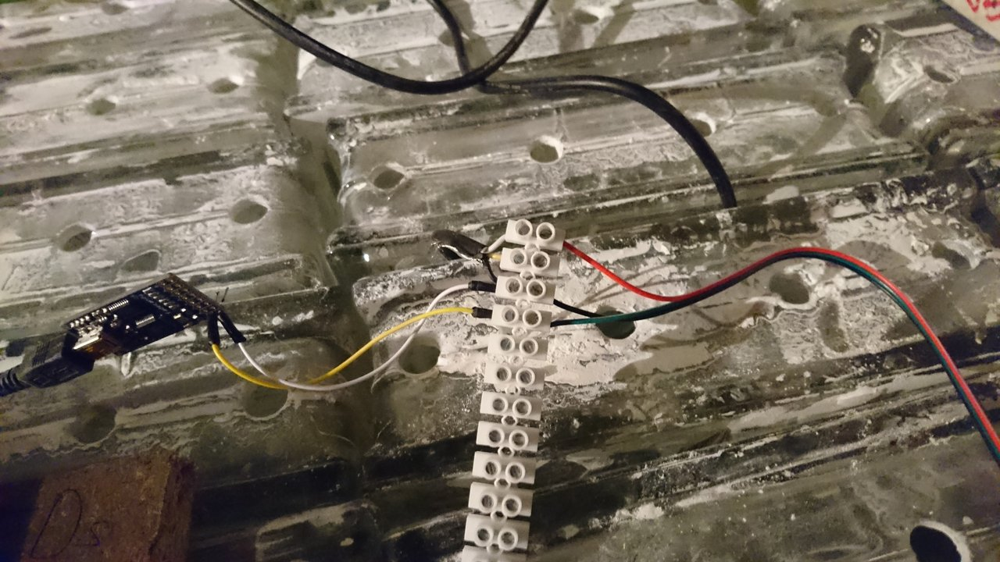

# LED Wand U+00BC 	

8*24 = 192 LEDs in Fall 2015

2*50 + 14*8 + 22*8 = 388 LEDs in May 2017

#### Parts

 * 1 x Raspberry Pi (we still have an old B model)
 * 3 x Fadecandy board (+3 x USB Type B mini)
 * ~60m extra cabeling (0.4mm² for signal and 0.7mm² for power)
 * ~10 LED strips with 50 WS2811S RGB LEDs each

## Raspberry Pi
Runs Raspian Jessie.

DNS: `gaenge`
Find via network scan:
`sudo nmap -sP 192.168.1.0/24 | awk '/^Nmap/{ip=$NF}/B8:27:EB/{print ip}'`

Auto starts fadecandy server and pixelcontroller via `/etc/rc.local`

## Fadecandy

https://github.com/scanlime/fadecandy

PWM controller supporting up to 512 LEDs

Can be controlled via `fcserver` application understanding:
* [Websocket](https://github.com/scanlime/fadecandy/blob/master/doc/fc_protocol_websocket.md)
* [OpenPixelControl protocol](https://github.com/scanlime/fadecandy/blob/master/doc/fc_protocol_opc.md)

#### Mapping
As we have the first window wired with snake cabeling and the newer part around the door wired in pieces, we need to provide information how that maps to a continuous rectangular display.

The OPC protocol has 1 broadcast channel (`0`) and 255 (`1-255`) discrete channels each being able to address up to 21845 3-color LEDs with 8bit per color.

## LEDs
WS2811S + RGB LEDs waterproof

## Power
Each RGB pixel uses up to 60 mA. At 580 pixels that makes 34.8 A at 5V, so around **170 W** when fully white. This is provided by an old standard computer ATX power supply.

Aditionally the Raspberry Pi (~220 mA) and the 3 Fadecandy boards (combined less than 150 mA) take around **4.5 W**

## PixelController

http://pixelinvaders.ch/?page_id=160

Forked to support OpenPixelControl protocol for fadecandy
https://github.com/master-lincoln/PixelController

## Simulator
There's an opengl simulator available in the `simulator` folder.

(window in the top left)

## Wall
You can open the diagram for editing by loading the raw file link of [img/Diagram.xml](img/Diagram.xml) in [draw.io](draw.io)

