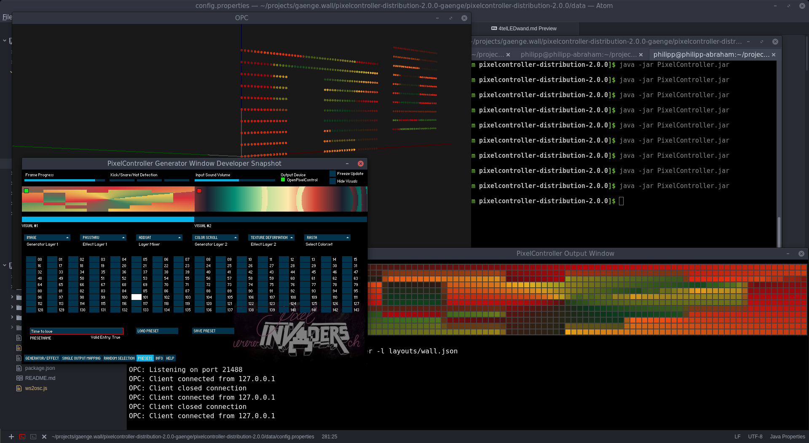

## Simulator

This uses the OPC server with an OpenGL visualization from [zestyping/openpixelcontrol](https://github.com/zestyping/openpixelcontrol)

Start it via:

```bash
gl_server -l wall.json
```

The file [`wall.py`](wall.py) contains the code to generate a description of the pixel positions for the visualization. It creates a matrix of the size **82 x 12** and hides the pixels that would be between our windows or where the door is.


